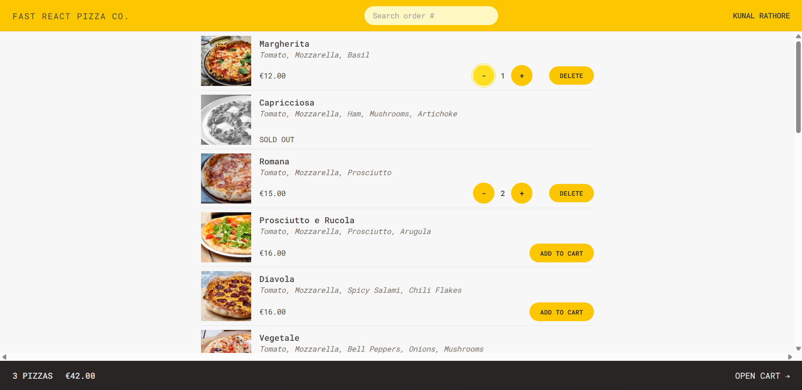
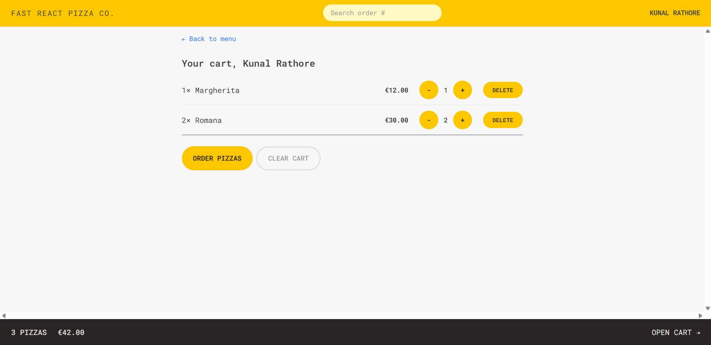
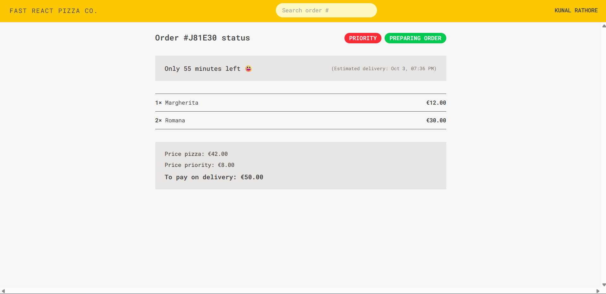

# 🍕 Fast React Pizza App

Order your favorite pizzas online. **Fast React Pizza** provides a fast, modern, and smooth pizza ordering experience with cart management, order tracking, and user-friendly UI — all powered by React and Redux Toolkit.

---

## 🚀 Features

* 🍕 Browse and select pizzas from a menu
* 🛒 Add, update, and remove pizzas from the cart
* ✅ Global state management using **Redux Toolkit**
* 🔄 Async operations with **Redux Thunks** (fetch pizzas, orders)
* 🗺️ Data loading with **React Router v6.4+ loaders/actions**
* 👤 User and order tracking
* ⚡ Optimized with slices and modular state management
* 🎨 Styled with **Tailwind CSS**
* 🛠️ Built with **TypeScript**

---

## 🧰 Tech Stack

* **React**
* **TypeScript**
* **React Router DOM v6.4+ (Data API)**
* **Redux Toolkit (RTK)**
* **Redux Thunks**
* **Tailwind CSS**

---

## 📂 Project Structure

```
FAST-REACT-PIZZA/
├─ public/                 # Public assets
│   └─ vite.svg
└─ src/
   ├─ Features/
   │   ├─ cart/            # Cart slice, components
   │   ├─ menu/            # Menu components
   │   ├─ order/           # Order flow & components
   │   └─ user/            # User slice & components
   │
   ├─ hooks/               # Custom hooks
   ├─ Services/            # API services (geocoding, restaurants, etc.)
   ├─ types/               # TypeScript types
   ├─ UI/                  # Reusable UI components
   ├─ Utils/               # Helper functions
   ├─ App.tsx              # Root React component
   ├─ index.css            # Global styles (Tailwind)
   ├─ main.tsx             # Entry point
   ├─ store.ts             # Redux store configuration
   └─ vite-env.d.ts        # Vite TypeScript definitions
.eslintrc.json             # ESLint config
index.html                 # HTML entry template
package.json / package-lock.json
tailwind.config.js         # Tailwind CSS config
tsconfig.json / tsconfig.node.json
vite.config.ts             # Vite config
```

---

## ⚡ Getting Started

### 1️⃣ Clone the repo

```bash
git clone https://github.com/Kunal-dev788/Your-React-Pizzas.git
cd Your-React-Pizzas
```

### 2️⃣ Install dependencies

```bash
npm install
```

### 3️⃣ Run the development server

```bash
npm run dev
```

### 4️⃣ Build for production

```bash
npm run build
```

---

## 🌐 Deployment

This project can be deployed on **Netlify** or **Vercel**.

---

## 🎥 Demo

(Add your demo video/gif here)

🔗 [Live Demo on Netlify](https://youreactpizzas.netlify.app/)

---

## 📸 Screenshots

| Menu                                  | Cart                                  | Order                                   |
| ------------------------------------- | ------------------------------------- | --------------------------------------- |
|  |  |  |

---

## 📚 Learnings

* Practiced **Redux Toolkit** with slices & thunks for global state management
* Worked with **React Router Data APIs** (loaders, actions) for declarative data fetching
* Implemented a modular architecture with **features/** based structure
* Styled with **Tailwind CSS** for rapid UI development
* Enhanced TypeScript usage in real-world state and async logic

---
